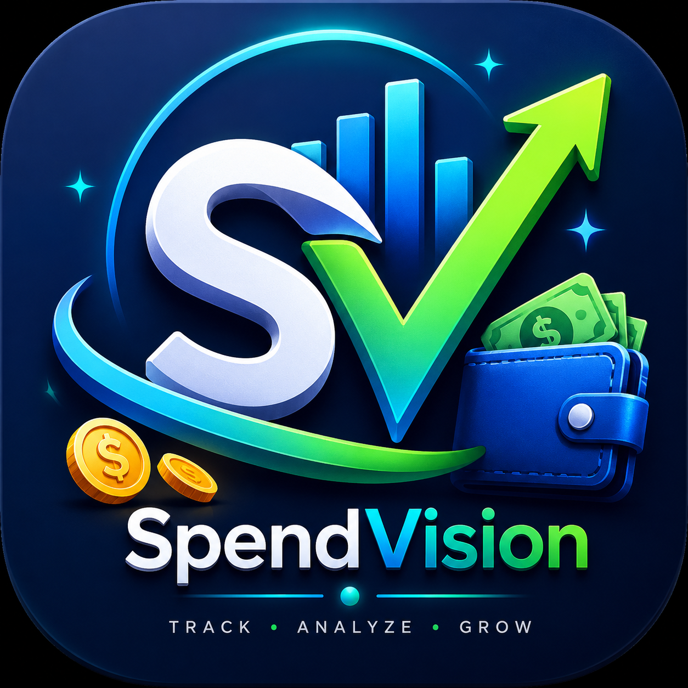

# SpendVision

  

## Overview

SpendVision is an AI-powered personal finance assistant that transforms receipt images into actionable financial intelligence.

Users can scan or upload receipts directly through the Android application. OCR technology extracts store names, dates, products, quantities, and prices from receipts, converting unstructured receipt data into a structured financial database.

Products are automatically categorised into spending groups such as groceries, transport, utilities, clothing, entertainment, and household expenses. Food purchases are further analysed into detailed subcategories including fruit, vegetables, snacks, drinks, and unhealthy foods.

The application also allows users to track long-term financial commitments such as mortgages, subscriptions, loans, and vehicle finance agreements, including repayment timelines, outstanding balances, and projected completion dates.

## OpenClaw Integration

What makes SpendVision different is the integration of OpenClaw. Rather than simply storing spending data, OpenClaw acts as an intelligent financial agent that analyses user spending behaviour, identifies recurring patterns, detects unusual expenses, and generates personalised financial insights.
SpendVision exports structured receipt data to an OpenClaw Financial Advisor workflow. OpenClaw analyses the user's spending, identifies high-risk categories, detects unusual expenses, and generates practical budgeting recommendations.
Using OpenClaw workflows, SpendVision can:

* Analyse spending habits across categories and time periods
* Identify opportunities to reduce unnecessary spending
* Detect significant price increases for frequently purchased products
* Monitor recurring subscriptions and financial commitments
* Generate personalised budgeting recommendations
* Create financial summaries and reports automatically
* Alert users to unusual or unexpected spending patterns

## Features

* Receipt scanning using OCR
* Automatic product extraction
* Smart spending categorisation
* Food sub-category analysis
* Long-term commitment tracking
* Historical price monitoring
* Spending dashboards and analytics
* AI-powered financial insights through OpenClaw

## Data & Analytics

All financial data is stored in a local database and presented through dashboards showing:

* Spending trends
* Category breakdowns
* Commitment tracking
* Historical price changes
* Budget recommendations
* Financial summaries

## Goal

The goal of SpendVision is not only to record expenses but to provide users with an intelligent financial assistant that helps them make better financial decisions through automation and AI-driven analysis.
